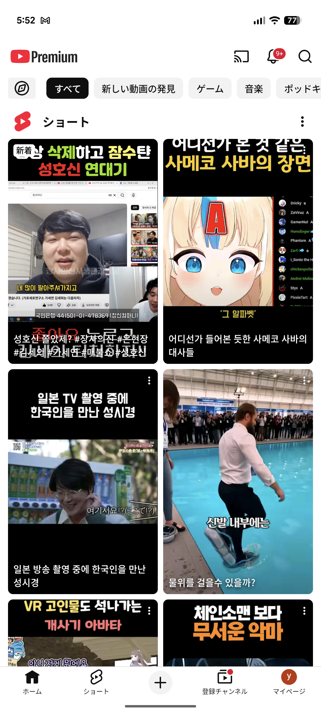

# 기반 코드 및 네비게이션 구조 명세 (Base Setup Spec)

## 1. 개요 (Overview)
본 문서는 'FakeYouTube' 프로젝트의 초기 기반 코드를 정의합니다. 사용자가 제공한 스크린샷을 바탕으로 UI 레이어의 뼈대를 구축하며, Material3 테마 설정, 5개 탭(Home, Shorts, Upload, Subscription, Library)을 포함한 네비게이션 구조, 그리고 `Scaffold` 기반의 기본 레이아웃을 구현합니다.

## 2. 요구사항 (Requirements)
*   **Material3 테마 시스템:** YouTube 브랜드 컬러(Red #FF0000)와 다크/라이트 모드를 지원하는 `ui/theme` 패키지 구성.
*   **네비게이션 (Navigation):** Jetpack Compose Navigation을 사용하여 5개 주요 탭 간의 이동을 구현.
*   **레이아웃 구조:**
    *   **TopAppBar:** 홈 화면 상단에 로고와 액션 아이콘(Cast, Notification, Search, Profile) 배치.
    *   **BottomNavigationBar:** 5개의 탭 아이콘과 라벨을 포함하며 항상 하단에 고정.
*   **화면 스켈레톤:** 각 탭(Home, Shorts 등)은 현재 화면 이름을 중앙에 표시하는 최소한의 Composable로 구현.

## 3. 기술적 상세 (Technical Details)

### 3.1 패키지 구조
```text
com.example.fakeyoutube
├── MainActivity.kt
├── ui
│   ├── theme          # Theme, Color, Type 정의
│   ├── navigation     # NavHost, Screen 정의
│   ├── screens        # 5개 탭별 Screen Composable
│   └── components     # 공통 UI (TopBar, BottomBar)
```

### 3.2 데이터 모델 (Navigation Route)
Type-safe한 라우트 관리를 위해 Sealed Class를 사용합니다.
```kotlin
sealed class Screen(val route: String, val title: String, val icon: ImageVector) {
    object Home : Screen("home", "Home", Icons.Filled.Home)
    object Shorts : Screen("shorts", "Shorts", Icons.Filled.PlayArrow)
    object Upload : Screen("upload", "Upload", Icons.Filled.AddCircle)
    object Subscription : Screen("subscription", "Subscription", Icons.Filled.Subscriptions)
    object Library : Screen("library", "You", Icons.Filled.AccountCircle)
}
```

### 3.3 UI 아키텍처
*   `MainActivity`: `FakeYouTubeTheme` 및 `MainScreen` 호스팅.
*   `MainScreen`: `Scaffold`를 사용하여 `topBar`, `bottomBar` 영역을 확보하고 `NavHost`를 관리.

## 4. UI/UX (Visual References)
*   **Header & Bottom Bar:** 상단 앱바와 하단 탭바의 레이아웃 참조.
    *   
*   **Content Area:** 메인 콘텐츠 영역 참조.
    *   

## 5. 구현 체크리스트 (Implementation Checklist)
*   [x] **기반 코드 - 테마 및 프로젝트 설정** (Issue #17)
    *   `libs.versions.toml` 의존성 확인.
    *   `ui/theme/Color.kt`, `Theme.kt`, `Type.kt` 작성 (YouTube Red 컬러 적용).
*   [ ] **기반 코드 - 화면 스켈레톤 및 라우트 정의** (Issue #18)
    *   `Screen` Sealed Class 정의.
    *   5개 탭(Home, Shorts, Upload, Subscription, Library) 빈 화면 Composable 구현.
*   [ ] **기반 코드 - 네비게이션 호스팅 및 하단 바 구현** (Issue #19)
    *   `BottomNavigationBar` 컴포저블 구현.
    *   `MainScreen` 내 `Scaffold` 및 `NavHost` 구성.
*   [ ] **기반 코드 - 홈 상단 앱바 (TopAppBar) 구현** (Issue #20)
    *   `HomeTopBar` 컴포저블 작성 (로고 및 아이콘 배치).
    *   `Scaffold`에 TopBar 적용.